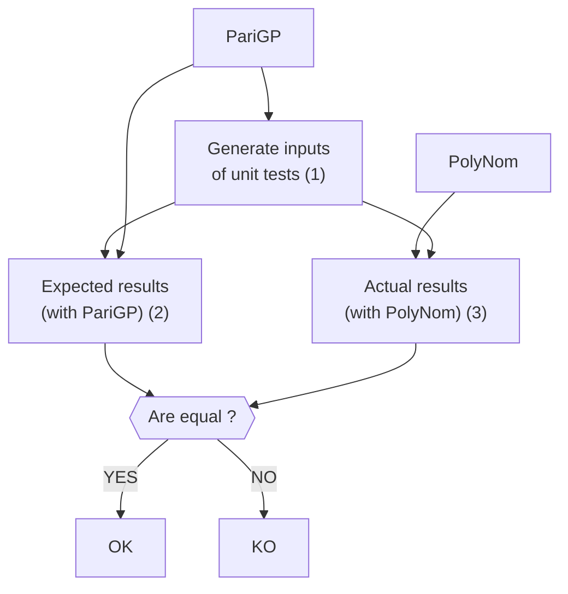

 

# PolyNom

## Description

PolyNom is a polynom manipulation library written in C with [GMP library](https://gmplib.org/). Many operations are handle, such as, addition, multiplication over Galois Field, and PolyNom can handle arbitrary long polynoms. A batch of unit tests assert the accuracy of the library with the use of the language [PariGP](https://pari.math.u-bordeaux.fr/).

## Why this project?

- Get my hands dirty my delving into the implementation of theoritical concepts I learn at university. 
- Experiment the test-driven development and code coverage.
- Become familiar with the GMP library.
- Challenge myself with a (relatively) large project :grinning:

## Features

- Manipulate arbitrary long polynom:
    - Coefficients are stored with a linked list;
    - The degree of the coefficients are stored with an `mpz_t` object.
- Arithmetic operations:
    - Usual addition, subtraction;
    - Addition, subtraction, multiplication and division over Galois Field;
    - Extended Greatest Common divisor over a Galois Field.
- Initialization operations:
    - Generate random polynoms;
    - Generate random irreducible polynoms.

## Test-Driven Development

PolyNom is develop with the a test-driven development.

### PariGP

[PariGP](https://pari.math.u-bordeaux.fr/) is an open-source language for computation in number theory: factorization, algebraic number theory, etc. In our context, we use PariGP to:

- Generate inputs for the unit tests of PolyNom (1);
- Compute the results expected by the functions of PolyNom (2).

We reasonnably assume that the result given by PariGP are always right (they can be used as a *ground truth*).

### Unit tests of PolyNom

The same inputs are used for the unit tests of PolyNom (3), and the results obtained with PariGP and PolyNom are compared. If they are equal, then the implementation of PolyNom is correct. Otherwise, some mistakes are still here (8).

### Code coverage

TODO

## Next steps

### Demonstration purpose

- [ ] Create a dockerfile to use the library directly by using Docker.

### Implementation enhancement

- [ ] Handle the case when the substraction of two polynoms gives zero.
- [ ] Manipulate polynom which have coefficient stored on `uint16_t`  or even `uint32_t` (for now, it is only `uint8_t`).

### Documentation

- [ ] Write a more precise documentation (the curent one may be not very clear on some point).

## How to use

`docker build -t `