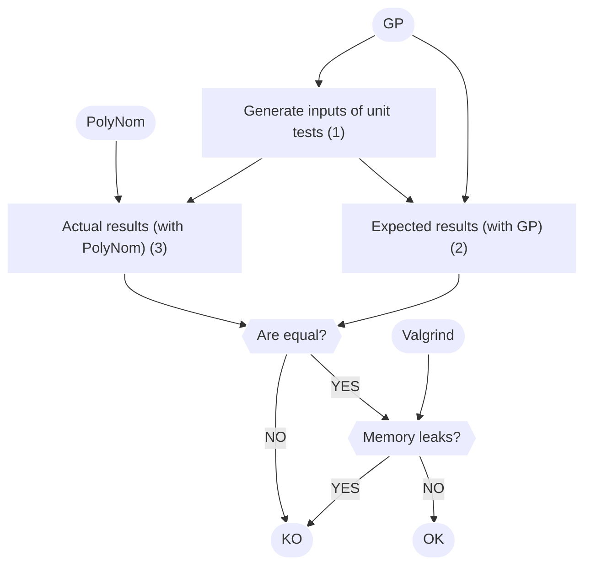

 

# PolyNom

:dart: PolyNomial is a polynomial manipulation library over finite fields tailored for cryptographic operations.

:computer: PolyNomial is written in C. The [GMP library](https://gmplib.org/) is used, as well as [GP](https://pari.math.u-bordeaux.fr/) unit tests.

:bulb: A key feature of PolyNom is that it can handle arbitrary long polynomials.

:rocket: Ready to explore my project? Checkout the [documentation](https://groumage.github.io/PolyNom/Doxygen/index.html)!

## TLDR Slides

Some concise slides to have an overview of PolyNom. A PDF version is available [here](https://github.com/groumage/PolyNom/blob/main/TLDR_slides/TLDR_slides.pdf). For an HTML version, see the following protocols for Linux or Windows.

### Linux

1. Download the TLDR_slides folder:

	1.1 Go to `https://download-directory.github.io/`

	1.2 Download the coverage folder which at `https://github.com/groumage/PolyNom/tree/main/TLDR_slides`

2. Unzip the TLDR_slides folder:

	2.1 `mkdir slides`

	2.2. `unzip groumage\ PolyNom\ main\ TLDR_slides.zip -d slides`

3. Print slides:
	
	3.1 `cd slides`
	
	3.2. `brave-browser coverage.html` or `firefox coverage.html`

### Windows

TODO

## Why this project?

- Dive deep into the practical implementation of theoretical concepts learned in my computer science and algebra classes. 
- Embrace the discipline of test-driven development (TDD).
- Become familiar with code coverage on (relatively) large project.
- Enhance my skills with the use of the GMP library.
- Learn how simple with github workflows works.
- The most important: **challenge myself** with a (relatively) large project :grinning:.

:triangular_flag_on_post: The purpose of this project is not to advance the state of the art in polynomials manipulations. 

## Features

- PolyNom allows you to manipulate arbitrary long polynomials:
    - Coefficients are stored with a linked list;
    - The degree of the coefficients are stored with an `mpz_t` object (an special type from the [GMP library](https://gmplib.org/)).
- Usual arithmetic operations on polynomials:
    - Usual addition, subtraction and multiplication;
    - Addition, subtraction, multiplication and division over Galois Field;
    - Greatest common divisor of two polynomials along with the Bézout coefficients.
- Generation of arbitrary long irreducible polynomials.

## Test-Driven Development

PolyNom is develop with the a test-driven development. The function of PolyNoms are evaluated with a language called PariGP used through its interactive shell GP.

### PariGP and GP

[PariGP](https://pari.math.u-bordeaux.fr/) is an open-source language for computation in number theory: factorization, algebraic number theory, etc. In our context, we use GP (an interactive shell to use GP's functoions) to:

- Generate inputs for the unit tests of PolyNom (1);
- Compute the results expected by the functions of PolyNom (2).

We reasonnably assume that the result given by PariGP are always right (in other words, they are used as a *ground truth*).

### Unit tests of PolyNom

The same inputs are used for the unit tests of PolyNom (3), and the results obtained with PariGP and PolyNom are compared. If they are equal, then the implementation of PolyNom is correct. Otherwise, some mistakes are still here.

Note that there is also a memory leaks check using [Valgrind](https://valgrind.org/).

## Code coverage

The code coverage is evaluated with the `gcovr` tool. The code coverage report is available [here](https://github.com/groumage/PolyNom/tree/main/coverage).

### Linux

1. Download the coverage folder:

	1.1 Go to `https://download-directory.github.io/`

	1.2 Download the coverage folder which at `https://github.com/groumage/PolyNom/tree/main/coverage`

2. Unzip the coverage folder:

	2.1 `mkdir coverage`

	2.2. `unzip groumage\ PolyNom\ main\ coverage.zip -d coverage`

3. Print coverage report:
	
	3.1 `cd coverage`
	
	3.2. `brave-browser coverage.html` or `firefox coverage.html`

### Windows

TODO

## Execute code in your computer

### How to run the tests within a docker?

`docker build -t polynom .`

`docker run -it polynom`

`./test.sh long 10`

### How to run the code coverage report?

`conda create -n Polynom python=3.8`

`conda activate Polynom`

`pip install gcovr`

`./coverage.sh`