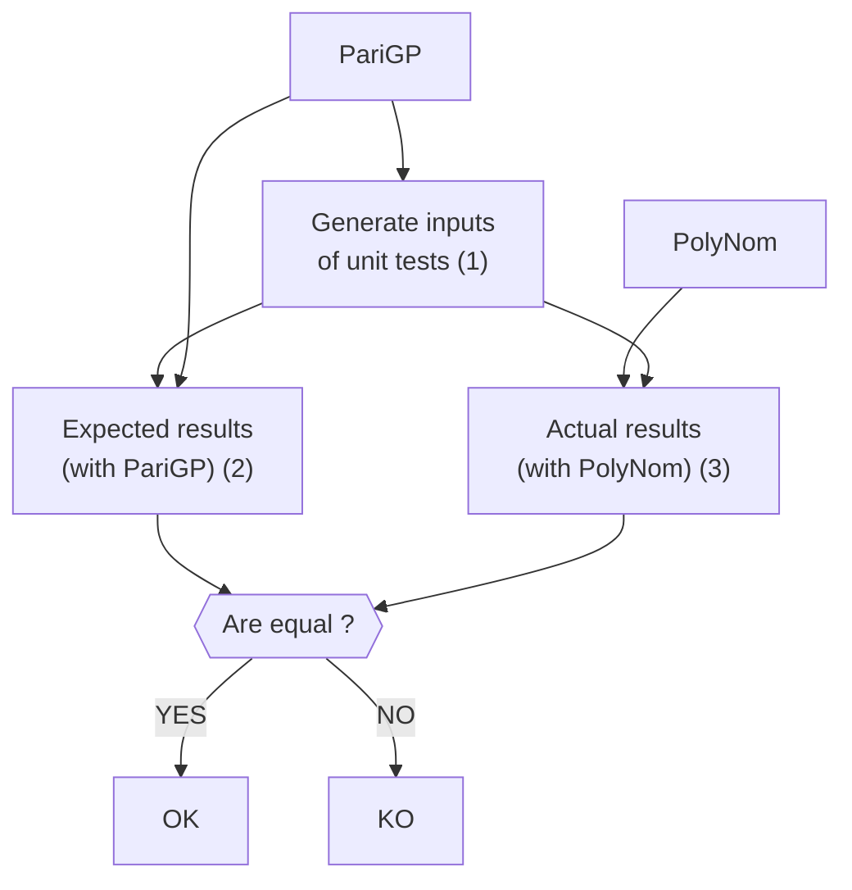

 

# PolyNomial

:dart: PolyNomial is a polynomial manipulation library over finite fields tailored for cryptographic operations.

:computer: PolyNomial is written in C. The [GMP library](https://gmplib.org/) is used, as well as the [PariGP](https://pari.math.u-bordeaux.fr/) language for unit tests.

:bulb: A key feature of PolyNomial is that it can handle arbitrary long polynomials.

:rocket: Ready to explore my project? Checkout the [documentation](https://groumage.github.io/PolyNomial/Doxygen/index.html)!

## Why this project?

- Dive deep into the practical implementation of theoretical concepts learned in my computer science and algebra classes. 
- Embrace the discipline of test-driven development (TDD).
- Become familiar with code coverage on (relatively) large project.
- Enhance my skills with the use of the GMP library.
- Learn how simple with github workflows works.
- The most important: **challenge myself** with a (relatively) large project :grinning:.

## Features

- PolyNom allows you to manipulate arbitrary long polynomials:
    - Coefficients are stored with a linked list;
    - The degree of the coefficients are stored with an `mpz_t` object (an special type from the [GMP library](https://gmplib.org/))
- Usual arithmetic operations on polynomials:
    - Usual addition, subtraction and multiplication;
    - Addition, subtraction, multiplication and division over Galois Field;
    - Greatest common divisor of two polynomials along with the Bézout coefficients.
- Generation of arbitrary long irreducible polynomials.

## Test-Driven Development

PolyNomial is develop with the a test-driven development. The function of PolyNoms are evaluated with a language called PariGP.

### PariGP

[PariGP](https://pari.math.u-bordeaux.fr/) is an open-source language for computation in number theory: factorization, algebraic number theory, etc. In our context, we use PariGP to:

- Generate inputs for the unit tests of PolyNomial (1);
- Compute the results expected by the functions of PolyNomial (2).

We reasonnably assume that the result given by PariGP are always right (in other words, they are used as a *ground truth*).

### Unit tests of PolyNom

The same inputs are used for the unit tests of PolyNom (3), and the results obtained with PariGP and PolyNom are compared. If they are equal, then the implementation of PolyNom is correct. Otherwise, some mistakes are still here.

### Code coverage

The code coverage is evaluated with the `gcov` tool. Execution of './coverage.sh' will generate a code coverage report. Almost 75 % of the code is covered by the unit tests.

### How to run the tests?

'docker build -t polyNom .'

'docker run -it polyNom'

'./test.sh long 10'