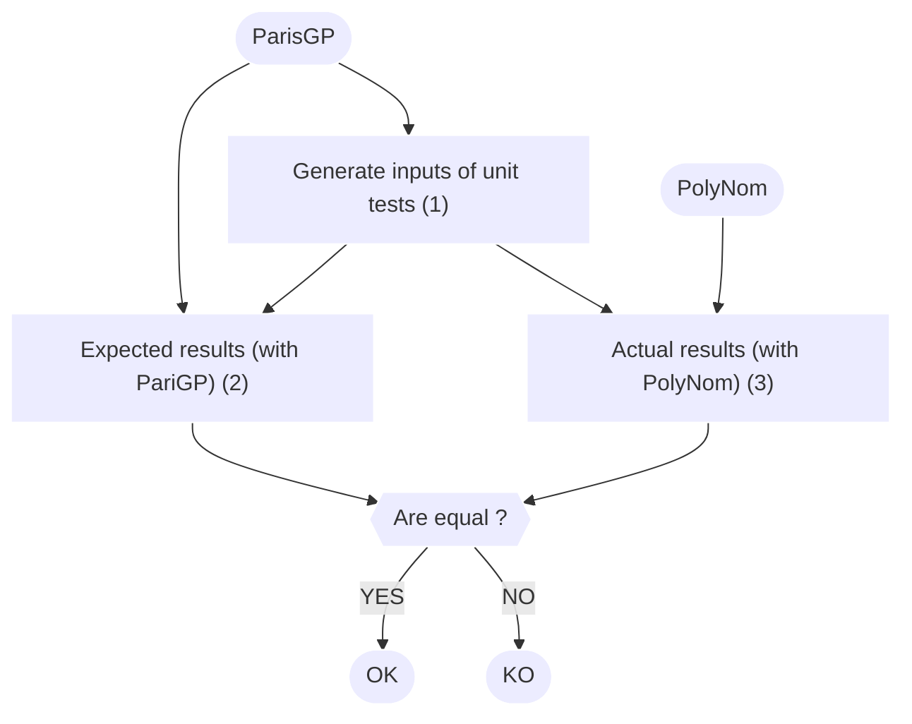

# PolyNom

:dart: A library to manipulate polynoms over finite fields.

:closed_lock_with_key: Design for cryptographic operations.

:rocket: Explore this project on [github](https://github.com/groumage/PolyNom)!

https://github.com/groumage/PolyNom/

---
## Technical overview

:computer: Technology stacks:
- C language
- GMP library
- PariGP

---
## Test-Driven Development

 :mag_right: PariGP generates random inputs and expected outputs that PolyNom's functions should return.
 
<style> .mermaid { min-width: 100%; max-width: 100%;} .mermaid foreignObject {overflow: visible;} </style>


 

---

Should we do a demonstration?

Require less than 5 min :clock9:

---
# Conclusion

:rocket: Checkout the [PolyNom](https://github.com/groumage/PolyNom) project!

:book: There is also a nice [documentation](https://groumage.github.io/PolyNom/Doxygen/index.html)!

---

## Bonus: Technical overview

:bulb: PolyNom can handle arbitrary long polynomials.

<style> .reveal {font-size: 2.5em} </style>

```c
typedef struct fp_poly_t
{
	mpz_t index_coeff;
	list_t *coeffs;
} fp_poly_t; 
```

$P(x) = 2 + x^{2} + x^{3}$

$P_{\text{index coeff}} = 1011_2 = 11_{10}$

$P_{\text{coeffs}} = \{ 2 \} \to \{ 1 \} \to \{ 1 \} \to NULL$