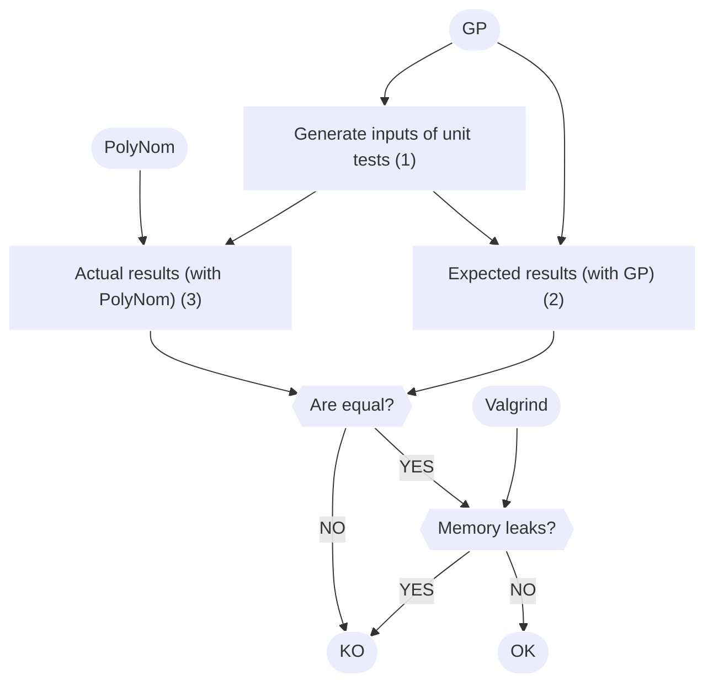
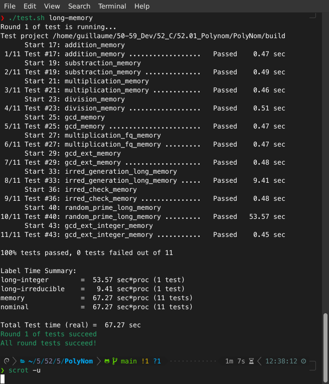

# PolyNom

:dart: A library to manipulate polynomials over finite fields.

:closed_lock_with_key: Design for cryptographic operations.

:rocket: Explore this project on [GitHub](https://github.com/groumage/PolyNom)!

https://github.com/groumage/PolyNom/

---

## Technical overview

:computer: Technology stacks:
- C language
- [GMP library](https://gmplib.org/)
- [GP](https://pari.math.u-bordeaux.fr/)[^1]
- [Valgrind](https://valgrind.org/)
- [Gcovr](https://github.com/gcovr/gcovr)

[^1]: An interactive shell providing fast computation functions in number theory.

---

## Test-Driven Development

 :mag_right: GP generates random inputs and expected outputs that PolyNom's functions should return.
 
<style> .mermaid { min-width: 50%; max-width: 50%; } .mermaid foreignObject {overflow: visible;} </style>


 

---

## Code coverage

:flashlight: Code coverage of PolyNom is performed Gcovr.

:gear: 76% of lines of codes, 79 % of functions and 82 % of branches are covered.

Code coverage report (open it in your favorite browser):
https://github.com/groumage/PolyNom/coverage/coverage.html

---

## Demonstration

:camera: Unit tests execution of usual operations $(512 \leq deg(P_{\text{inputs}}) \leq 2048)$ along with Valgrind.



---

# Conclusion

:bulb: PolyNom manipulates arbitrary long polynomials over finite fields.

:gear: PolyNom's functions are tested with Valgrind.

:flashlight: A [code coverage](https://github.com/groumage/PolyNom/coverage/coverage.html) of PolyNom is performed.

:rocket: Checkout [PolyNom](https://github.com/groumage/PolyNom) and its nice [documentation](https://groumage.github.io/PolyNom/Doxygen/index.html)!

---

## Bonus: Technical overview

<style> .reveal {font-size: 2.5em} </style>

```c
typedef struct fp_poly_t
{
	mpz_t index_coeff;
	list_t *coeffs;
} fp_poly_t; 
```

$P(x) = 2 + x^{2} + x^{3}$

$P_{\text{index coeff}} = 1011_2 = 11_{10}$

$P_{\text{coeffs}} = \{ 2 \} \to \{ 1 \} \to \{ 1 \} \to NULL$